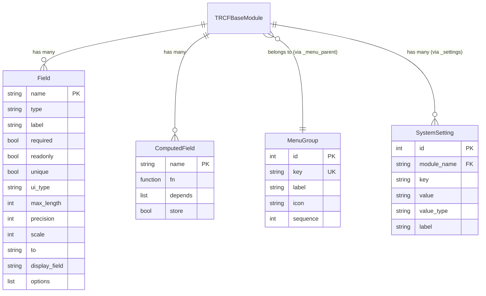

# Data Model: TRCFBaseModule CRUD Framework

**Date**: 2026-03-26  
**Feature**: 002-trcf-base-module

## Entity Relationship Diagram



## Auto-Generated Columns (Every TRCFBaseModule)

| Column | Type | Auto | Notes |
|---|---|---|---|
| `id` | INTEGER PK | Always | Auto-increment |
| `created_at` | DATETIME | Always | Set on create |
| `updated_at` | DATETIME | Always | Set on update |
| `created_by` | INTEGER NULL | Always | User ID (handler layer) |
| `updated_by` | INTEGER NULL | Always | User ID (handler layer) |
| `active` | BOOLEAN | If `_archive=True` | Default `True`, for archive/restore |
| `version` | INTEGER | If `_optimistic_lock=True` | For conflict detection |

## Field Type → DB Column Mapping

| Field Class | DB Column | Python Type | Schema Type | Validation |
|---|---|---|---|---|
| CharField | VARCHAR(max_length) | str | "string" | max_length |
| TextField | TEXT | str | "string" | ui_type="textarea" |
| IntField | INTEGER | int | "integer" | min_value, max_value |
| FloatField | FLOAT | float | "float" | — |
| BooleanField | BOOLEAN | bool | "boolean" | — |
| DateTimeField | DATETIME | datetime | "datetime" | — |
| DateField | DATE | date | "date" | — |
| JSONField | JSON | dict\|list | "json" | — |
| ForeignKeyField | INTEGER FK | int | "foreignkey" | FK exists check |
| ManyToManyField | *(junction table)* | list[int] | "m2m" | FK exists check |
| DecimalField | NUMERIC(p,s) | Decimal | "decimal" | precision, scale |
| SelectionField | VARCHAR(100) | str | "selection" | value in options |
| FileField | VARCHAR(500) | str | "file" | upload handler |
| ImageField | VARCHAR(500) | str | "image" | upload + preview |

## State Transitions

### Record Lifecycle (when `_archive=True`)

```
[Created] → active=True
    │
    ├── PUT /{id} → [Updated] (active=True)
    │
    ├── POST /{id}/archive → [Archived] (active=False)
    │       │
    │       └── POST /{id}/restore → [Active] (active=True)
    │
    └── DELETE /{id} → [Deleted] (removed from DB)
```

### Record Lifecycle (when `_archive=False`)

```
[Created] → active column not present
    │
    ├── PUT /{id} → [Updated]
    │
    └── DELETE /{id} → [Deleted] (removed from DB)
```

## CMS Core Models (Prerequisites — Already Exist)

| Model | Table | Purpose |
|---|---|---|
| User | users | Auth users |
| Group | groups | Permission groups |
| GroupPermission | group_permissions | Module+action permissions |
| RefreshToken | refresh_tokens | JWT refresh tokens |
| MenuGroup | menu_groups | **NEW** — Sidebar menu groups |
| SystemSetting | system_settings | **NEW** — Module settings key-value |

## Junction Table Naming Convention

ManyToManyField auto-generates junction tables:

```
{source_table}_{target_table}
```

Example: `Product` with `tags = ManyToManyField(to="tags")`  
→ Junction table: `products_tags` with columns: `product_id FK`, `tag_id FK`
